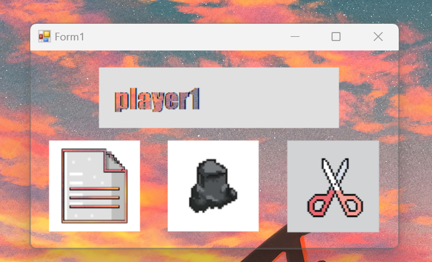

Two-Player Online Rock-Paper-Scissors Game
---------------------------------------------------------------------------------------------------------------------------------------
This project is an implementation of a classic rock-paper-scissors game that allows two players to play against each other online.
Players can connect to the game server, choose their moves (rock, paper, or scissors), and see the outcome of each round in real-time.

Features:
---------------------------------------------------------------------------------------------------------------------------------------

Multiplayer Online Gameplay: Players can connect to the server using ngrok and play against each other from different locations.
Real-Time Communication: Utilizes sockets to enable real-time communication between players and the server.
User Authentication: Players can register their usernames and log in to track their game statistics.
Scalable Architecture: Designed with scalability in mind to accommodate multiple simultaneous game sessions.
Responsive UI: Provides an intuitive user interface for an enjoyable gaming experience on different devices.

Technologies Used:
---------------------------------------------------------------------------------------------------------------------------------------
Python: Backend server implementation using Python for socket programming.
C# (WinForms): Frontend client implementation using C# with WinForms for the graphical user interface.
Ngrok: Route IP Address
GitHub: Version control and collaboration platform for managing project code.

How to Play (for Windows)
---------------------------------------------------------------------------------------------------------------------------------------
### Using Visual Studio (highly recommended)

- Install visual Studio <a href="https://visualstudio.microsoft.com/downloads">here</a>

- Once opened, clone the repo https://github.com/Uglypr1nces/Online_RPS.git in Visual Studio

- Run project, you will get a file missing error but dont worry, after youve ran it, execute the file_mover.ps1 using powershell

4. Enjoy!

### Using Command Line

- Clone the Project
```bash
   git clone https://github.com/Uglypr1nces/Online_RPS.git
```
- Install Dotnet.8.x sdk on the official dotnet website: https://dotnet.microsoft.com/en-us/download
  
- Build Project
```bash
    cd Online_RPS
    dotnet build Online_RPS.sln
```
- Move Content
```bash
    cd Online_RPS
    powershell -file image_mover.ps1
```

- Run Game
```bash
   bin/Debug/Online_RPS.exe
```

##Server
- Create an ngrok account at https://ngrok.com/ and download the exe in the server folder
  
- Run Server
```bash
    cd Server
    ngrok.exe tcp 8000
    python server.py
```
Contributing:
---------------------------------------------------------------------------------------------------------------------------------------
Contributions are welcome! If you'd like to contribute to the project, feel free to fork the repository, make your changes, and submit a pull request.
Any improvements, bug fixes, or feature enhancements are highly appreciated.

Screenshots:
---------------------------------------------------------------------------------------------------------------------------------------

